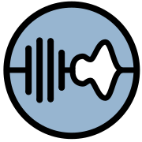
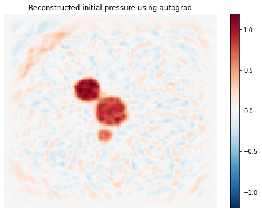

<div align="center">
</img>
</div>

# j-Wave: Differentiable acoustic simulations in JAX

[](https://discord.gg/VtUb4fFznt)
[](LICENSE)
[](https://github.com/ucl-bug/jwave/actions/workflows/ci_tests.yml)
[](https://codecov.io/gh/ucl-bug/jwave)
[](https://mybinder.org/v2/gh/ucl-bug/jwave/main?labpath=docs%2Fnotebooks%2Fivp%2Fhomogeneous_medium.ipynb)
[](https://colab.research.google.com/drive/1xAHAognF1v9un6GNvaGPSfdVeCDK8l9z?usp=sharing)

[Install](#install) | [Tutorials](https://ucl-bug.github.io/jwave/notebooks/ivp/homogeneous_medium.html) | [Documentation](https://ucl-bug.github.io/jwave) | [Changelog](HISTORY.md)

j-Wave is a library of simulators for acoustic applications. It is heavily inspired by [k-Wave](http://www.k-wave.org/)—a substantial portion of j-Wave is a port of k-Wave in JAX—and it's intended to be used as a collection of modular blocks that can be easily incorporated into any machine learning pipeline.

Embracing the philosophy of [JAX](https://jax.readthedocs.io/en/stable/), j-Wave is developed with the following principles in mind:

1. To be differentiable
2. To be efficient through `jit` compilation
3. To be easily run on GPUs
4. To be easily customizable


<br/>

## Install

Follow the instructions to install [Jax with CUDA support](https://github.com/google/jax#installation) if you wish to use your GPU.

Next, simply install `jwave` using pip:

```bash
pip install jwave
```

For more information, refer to the [Linux installation guide](docs/install/on_linux.md).

Due to JAX's limited support on Windows, j-Wave can only be run on Windows machines using the Windows Subsystem for Linux. Please refer to the [Installation on Windows guide](docs/install/on_win.md) for more details.

<br/>

## Example

This example simulates an acoustic initial value problem, which is often used as a simple model for photoacoustic acquisitions:

```python
from jax import jit

from jwave import FourierSeries
from jwave.acoustics.time_varying import simulate_wave_propagation
from jwave.geometry import Domain, Medium, TimeAxis
from jwave.utils import load_image_to_numpy

# Simulation parameters
N, dx = (256, 256), (0.1e-3, 0.1e-3)
domain = Domain(N, dx)
medium = Medium(domain=domain, sound_speed=1500.)
time_axis = TimeAxis.from_medium(medium, cfl=0.3, t_end=.8e-05)

# Initial pressure field
p0 = load_image_to_numpy("docs/assets/images/jwave.png", image_size=N)/255.
p0 = FourierSeries(p0, domain)

# Compile and run the simulation
@jit
def solver(medium, p0):
  return simulate_wave_propagation(medium, time_axis, p0=p0)

pressure = solver(medium, p0)
```




## Support

[](https://discord.gg/VtUb4fFznt)

If you encounter any problems with the code or wish to propose new features, please feel free to open an issue. If you need general guidance, wish to discuss something, or just want to say hi, don't hesitate to leave a message in our [Discord channel](https://discord.gg/VtUb4fFznt).

<br/>

## Contributing

Contributions are absolutely welcome! Most contributions start with an issue. Please don't hesitate to create issues in which you ask for features, give feedback on performances, or simply want to reach out.

To make a pull request, please look at the detailed [Contributing guide](CONTRIBUTING.md) for how to do it, but fundamentally keep in mind the following main guidelines:

- If you add a new feature or fix a bug:
  - Make sure it is covered by tests
  - Add a line in the changelog using `kacl-cli`
- If you changed something in the documentation, make sure that the documentation site can be correctly build using `mkdocs serve`

<br/>


## Citation

[](https://arxiv.org/abs/2207.01499)

If you use `jwave` for your research, please consider citing it as:

```bibtex
@article{stanziola2022jwave,
    author={Stanziola, Antonio and Arridge, Simon R. and Cox, Ben T. and Treeby, Bradley E.},
    title = {j-Wave: An open-source differentiable wave simulator},
    publisher = {arXiv},
    year = {2022},
}
```

<br/>

## Related Projects

1. [`ADSeismic.jl`](https://github.com/kailaix/ADSeismic.jl): a finite difference acoustic simulator with support for AD and JIT compilation in Julia.
2. [`stride`](https://github.com/trustimaging/stride): a general optimisation framework for medical ultrasound tomography.
3. [`k-wave-python`](https://github.com/waltsims/k-wave-python): A python interface to k-wave GPU accelerated binaries
