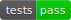

# jWave


[](https://codecov.io/gh/astanziola/jwave)


jWave is a library for performing pseudospectral simulations of acoustic signals. Is heavily inspired by [k-Wave](http://www.k-wave.org/) (in its essence, is a port of k-Wave in JAX), and its intented to be used as a collection of modular blocks that can be easily included into any machine learning pipeline.

Following the phylosophy of [JAX](https://jax.readthedocs.io/en/stable/), jWave is developed with the following principles in mind

1. Differntiable
2. Fast via `jit` compilation
3. Easy to run on GPUs


## :floppy_disk: Install
Before installing `jwave`, make sure that [you have installed JAX](https://github.com/google/jax#installation). Follow the instruction to install JAX with NVidia GPU support if you want to use `jwave` on the GPUs. 

Install jwave by `cd` in the repo folder an run
```bash
pip install -r requirements.txt
pip install -e .
```

If you want to run the notebooks, you should also install the following packages
```bash
pip install jupyter, tqdm
```

A lot of functionality is still missing compared to `kWave`, expecially in terms of functions constructing objects. If you want to use some `kWave` methods from python (for example the `kArray` class implementing off-grid sources), you should install the MATLAB engine for python. For example:
```bash
conda activate myenv
module load Matlab/2019a
cd /apps/software/Matlab/R2019a/extern/engines/python/
python setup.py build --build-base=$(mktemp -d) install
```

## :bookmark_tabs:  Access documentation
To access the documentation, you need to first forward the port 8000 of the machine you are connecting to.
In your local bash, type
```bash
ssh -L 8000:localhost:8000 username@remote.address
```
 This is not needed if you are working on your local machine.

After login, activate the environment. The first time you also need to install some extra packages packages
```bash
conda activate myenv
pip install -r dev_requirements.txt
```
To build and serve the documentation, type 
```bash
mkdocs serve
```
from the root folder of the repository and then navigate to [`http://localhost:8000/`](http://localhost:8000/) in a browser.

If the above command fails, you may need to install some extra packages via `pip` before being able to build the documentation, such as `mkdocs`, `markdown-katex` and `mkdocstrings`: they will be listed at the end of the output returned by `mkdocs serve`.

## :arrow_right: Start using jWave

*Note:* Those links work only if `mkdocs serve` is running

1. [Getting started](http://127.0.0.1:8000/examples/first_example/)
2. [Simulation examples](http://127.0.0.1:8000/examples/monopole_homogeneous/)
3. [Optimization examples](http://127.0.0.1:8000/examples/differentiate_trough_solver/)
4. [API Reference](http://127.0.0.1:8000/api_geometry/)

## Related

### Projects

1. [`ADSeismic.jl`](https://github.com/kailaix/ADSeismic.jl): a finite difference acoustic simulator with support for AD and JIT compilation in Julia.

### Papers
1. [`Adler et al. 2021`](https://ieeexplore.ieee.org/stamp/stamp.jsp?tp=&arnumber=9363496): Deep Learning for Seismic Inverse Problems
