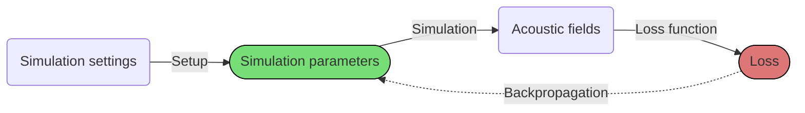

# j-Wave
*Fast and differentiable acoustic simulations in JAX*



j-Wave is a library for performing simulations of acoustic problems, and in general for the construction of differentiable PDE and ODE solvers. In its core, is heavily inspired by [k-Wave](http://www.k-wave.org/) (in its essence, most of it is a port of k-Wave in JAX), and its intented to be used as a collection of modular blocks that can be easily included into any machine learning pipeline.

Following the phylosophy of [JAX](https://jax.readthedocs.io/en/stable/), jWave is developed with the following principles in mind

1. Fully differentiable 
2. Fast via hardware-specific `jit` compilation
3. Easy to run on GPUs and TPUs
4. Easy to customize to support novel research ideas

[Start using j-Wave](examples/first_example){ .md-button }

## Basic install

Make sure [you have installed JAX](https://github.com/google/jax#installation), preferably with GPU support.  j-Wave can then be installed via pip
```bash
pip install --upgrade pip
pip install --upgrade jwave
```
A more detailed installation guide can be found [in this page](install.md).
