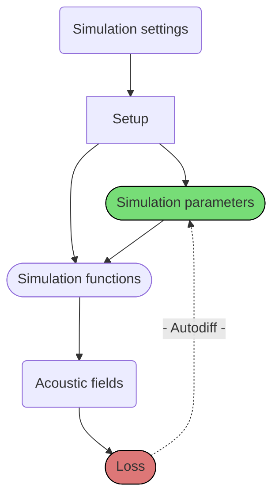

# j-Wave
*Fast and differentiable acoustic simulations in JAX*



j-Wave is a library for performing simulations of acoustic problems, and in general for the construction of differentiable PDE and ODE solvers. In its core, is heavily inspired by [k-Wave](http://www.k-wave.org/) (in its essence, most of it is a port of k-Wave in JAX), and its intented to be used as a collection of modular blocks that can be easily included into any machine learning pipeline.

Following the phylosophy of [JAX](https://jax.readthedocs.io/en/stable/), j-Wave is developed with the following principles in mind

1. Fully differentiable
2. Fast via hardware-specific `jit` compilation
3. Easy to run on GPUs and TPUs
4. Easy to customize to support novel research ideas, including novel discretizations via [`jaxdf`](https://github.com/ucl-bug/jaxdf)

[Get started j-Wave](notebooks/homog_propagation_medium/){ .md-button }

## Install

Make sure [you have installed `jaxdf`](https://github.com/ucl-bug/jaxdf#installation), preferably with GPU support.

j-Wave can then be installed via pip by moving to its root directory and running

```bash
pip install --upgrade .
```
